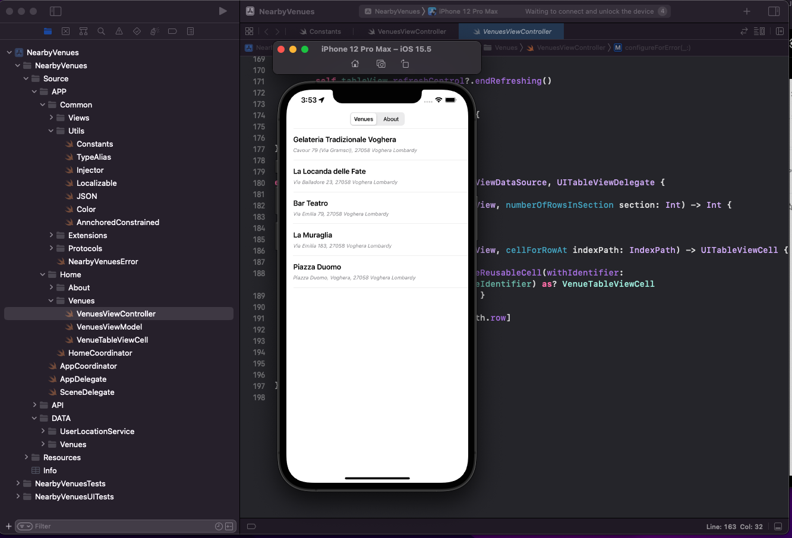
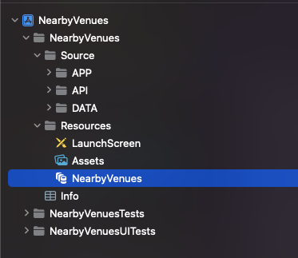
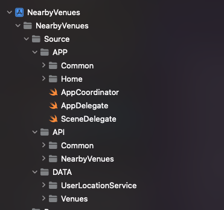

# iOS project template

  

This repository contains an iOS Project with a Clean Architecture( MVVM with COORDINATORS). It provides nearby Venues using FourSquareAPI. If device is offline it will load latest 5 venues. I use Core Data to store data for offline usage.

---
#### Table of Contents

* [Introduction](#introduction)
* [Xcode Project](#xcode-project)
  * [Project structure](#project-structure)
* [Usage](#usage)
---

## Introduction

To Get this project just `git clone` . There are no pods or third-party libraries installed on this project

The repository contains an app that will list 5 nearby venues. It has an offline usage too, if user doesn't have internet app will load latest saved 5 venues.s

## Xcode Project

The iOS template consists of an Xcode project file for the app ([iOSProject.xcodeproj](./iOSProject.xcodeproj)). The structure is:

### Project structure

The app project is separated into two main folders: _Source_ and _Resources_. Inside _Source_ folder I have three subfolders: _API_, _APP_ and _DATA_. There is a separate folder for each layer, making the app structure very scalable.Subfolders Structure is:

**Source**: Containts all the code for the project
  - **API**: Is the `API` layer that is reponsible for the web service layer.
  - **App** is the layer that handles the application logic, views, viewControllers etc
  - **DATA** Is responible for the `Data` layer wich means: Models, Repositorys etc

**Resources**: Contains all assets for the app, like the launch screen or the image assets.

**SceneDelegate.swift**: In the `SceneDelegate` the main `UIWindow` instance of the app is created, and the `VenuesViewController` instance is assigned as the root view controller. Modern app architectures, like _MVVM_  work better with manual creation of the entry point, than using the `Main Interface` possibility. Therefore the `Main.storyboard` file was deleted and the `Main Interface` reference from the project removed.
There is an `AppCoordinator` that is responsible for launching and navigation and an `Injector` that will handle dependency.

